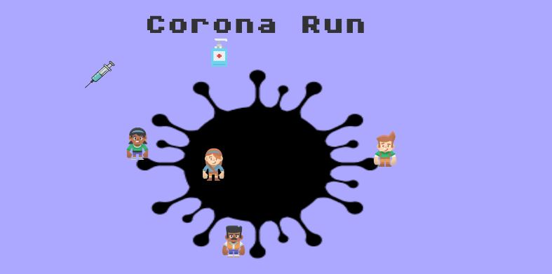

# CoronaRun
This game was created for a 5 day long GameJam hosted by UNSWGameDev society.
 
You can download the orginal game from [CoronaRun](https://gamenchill.itch.io/coronarun), this game is only available for Windows users.

  
This was a small 2D game something like flappy bird, this game is created using Unity game engie and C# as the programming languague. The assets for this game is taken from 
a free game assets website [Here](https://www.kenney.nl/assets) and some assets were made by me using photoshop.
In This repo I am just adding the script I used to create the game.

  

This will be return a solved sudoku:
  

  
And if the solution for that sudoku does not exist it will be return a unfilled sudoku:
  

